# Mediroza General Hospital — Web Application Penetration Test

**Networkwalks Internship — Batch B083 | Week 4**

> ⚠️ **Disclaimer:** This engagement was conducted in a controlled training environment for educational purposes only, against a target for which explicit written authorisation was provided by Networkwalks. The techniques documented here must never be applied to any system without explicit written permission from the owner.

---

## 📋 Engagement Overview

| | |
|---|---|
| **Target** | `https://medirozahospital.com` |
| **Engagement Type** | Black-box Penetration Test |
| **Duration** | 5 Days |
| **Objective** | Identify vulnerabilities, exploit them to demonstrate real impact, and document findings in a professional report |

This repository contains the full evidence trail and final report for a structured, four-milestone penetration test:

1. **M1 — Initial Access**: Attack the website and retrieve confidential patient PDF lab reports
2. **M2 — Data Extraction**: Crack the encryption on all retrieved files
3. **M3 — Critical Data Exposure**: Find the critical data exposure on the client server
4. **M4 — Reporting**: Write a professional penetration testing report

---

## 🛠️ Tools Used

`whois` · `nslookup` · `dnsrecon` · `nmap` (Zenmap) · `whatweb` · `curl` · `theHarvester` · `pdf2john` / dictionary-attack tooling · `exiftool` · `qpdf` · manual browser-based testing

---

## 🔍 Summary of Findings

| ID | Finding | Milestone | Risk |
|----|---------|-----------|------|
| F1 | SQL Injection — Authentication Bypass (Patient Portal) | M1 | 🔴 Critical |
| F2 | Unauthenticated Exposure of Full Database Backup (`/old/`) | M3 | 🔴 Critical |
| F3 | Weak / Predictable Passwords on Confidential PDF Reports | M2 | 🟠 High |
| F4 | Username Enumeration on Patient Portal Login | M1 | 🟡 Medium |
| F5 | Sensitive Metadata Disclosure in Distributed PDF Documents | M3 | 🟡 Medium |
| F6 | Staff Login Portal — Resistant to Tested Attacks (Positive Control) | Supplementary | ⚪ Informational |

---

## M1 — Initial Access

The homepage exposed two authentication entry points: **Patient Portal** and **Staff Login**.

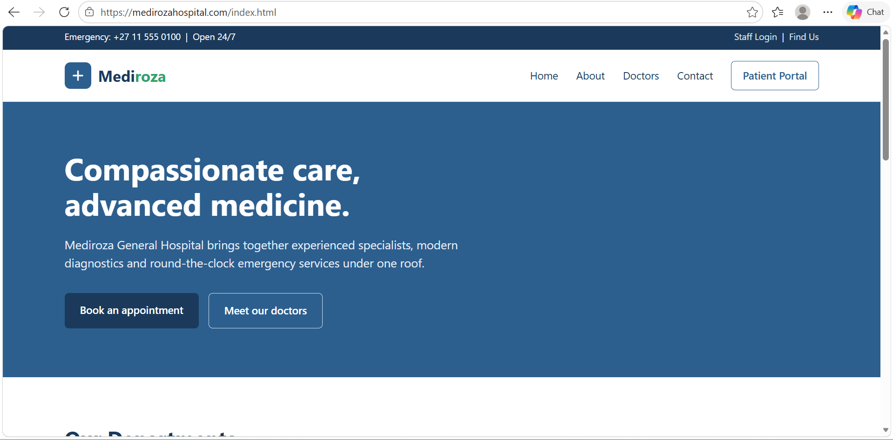

The Patient Portal login form returned distinct error messages depending on whether a submitted username existed — a username enumeration flaw (**F4**).

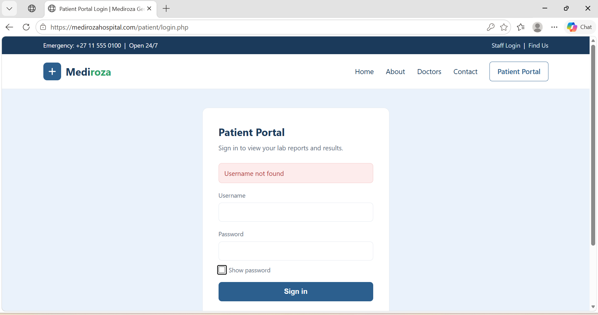

Submitting a classic SQL injection payload (`admin' --`) in the Username field bypassed authentication entirely (**F1**):

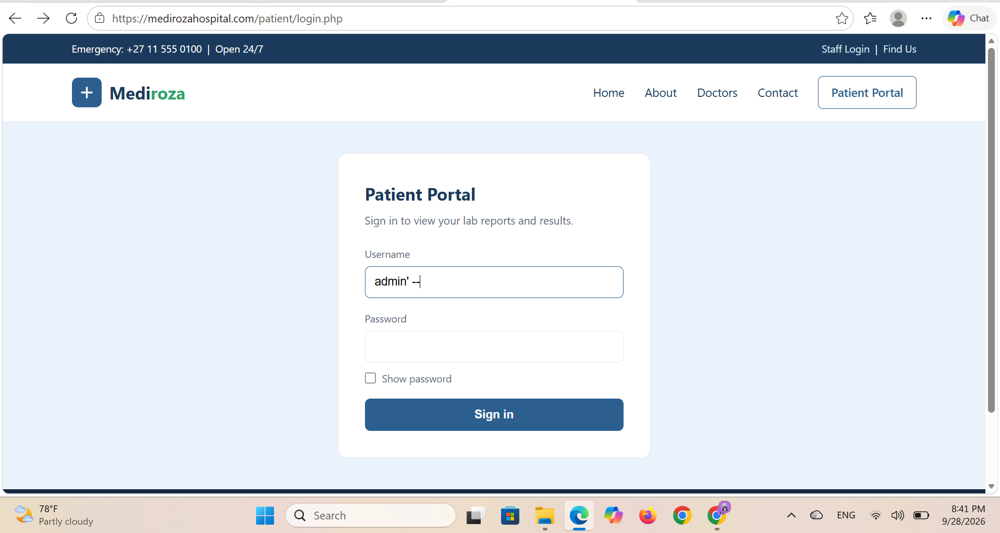

This granted full access to the Patient Portal, listing all three confidential patient pathology reports:

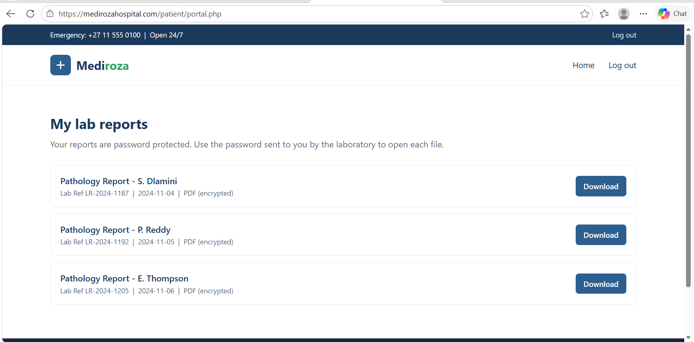

---

## M2 — Data Extraction

All three retrieved PDFs were encrypted (RC4, 128-bit, Revision 3). Hashes were extracted with `pdf2john` and cracked via dictionary attack — two instantly, one requiring an extended wordlist (**F3**):

| File | Patient | Password |
|------|---------|----------|
| `patient_report_1.pdf` | S. Dlamini | `123456` |
| `patient_report_2.pdf` | P. Reddy | `password` |
| `patient_report_3.pdf` | E. Thompson | `!@#$%^&` |

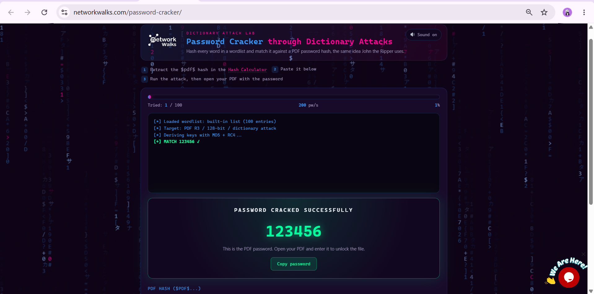
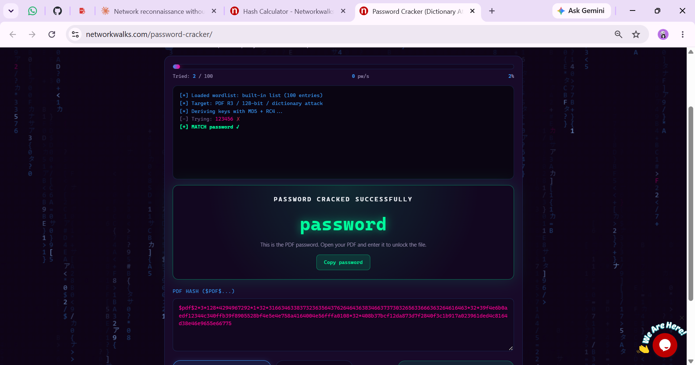
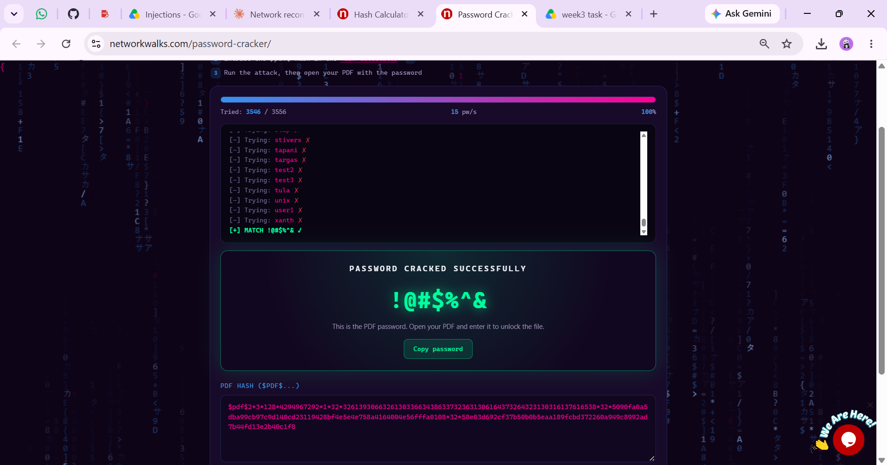

---

## M3 — Critical Data Exposure

Metadata analysis of the decrypted PDFs (`exiftool`) revealed an internal operational comment in `patient_report_3.pdf`, plus a leaked internal staff username in the Author field (**F5**):

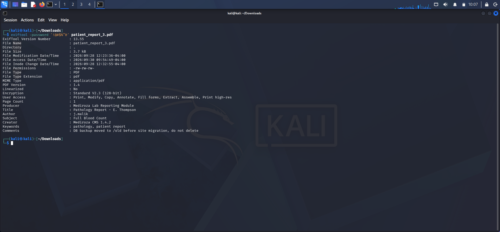

> *"DB backup moved to /old before site migration, do not delete."*

Following this lead to `https://medirozahospital.com/old/` revealed an **open, unauthenticated directory listing** containing a full SQL database backup (**F2** — the most critical finding of the engagement):

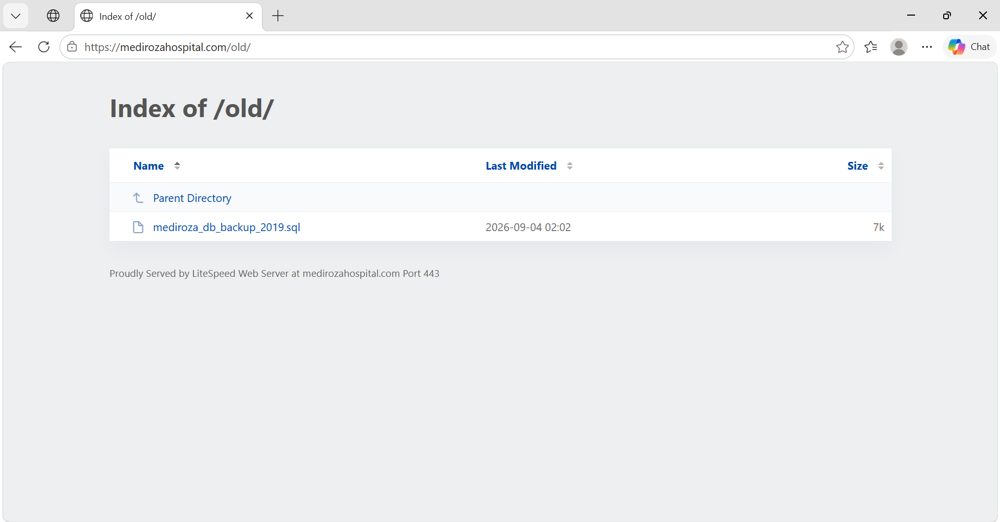

The backup contained complete `staff` (30 records: names, national IDs, salaries) and `shareholders` (10 records: ownership %, share class) tables:

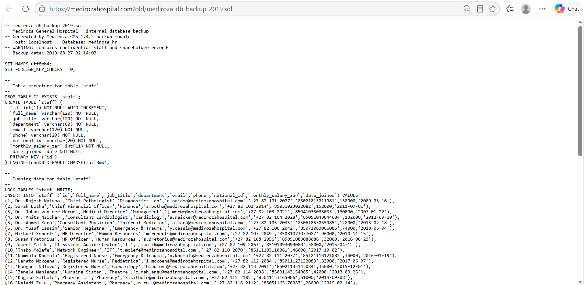
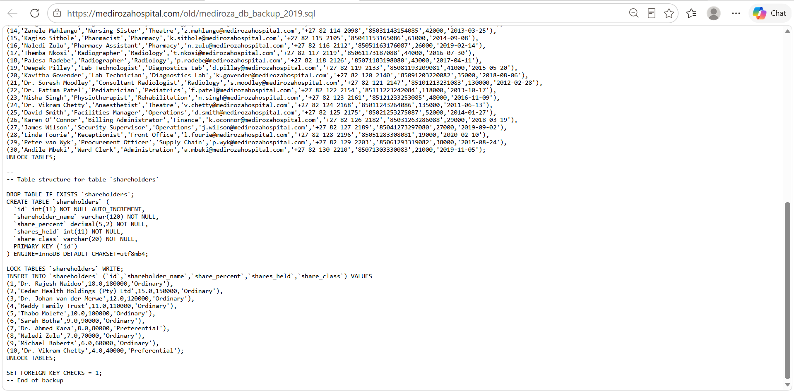

---

## Supplementary — Staff Login (Positive Control)

The same SQL injection payloads and enumeration tests were run against `/staff/login.php` for comparison. Unlike the Patient Portal, it returned an identical generic error regardless of payload or username (**F6** — a negative/positive-control result, indicating this form is not vulnerable to the tested attacks):

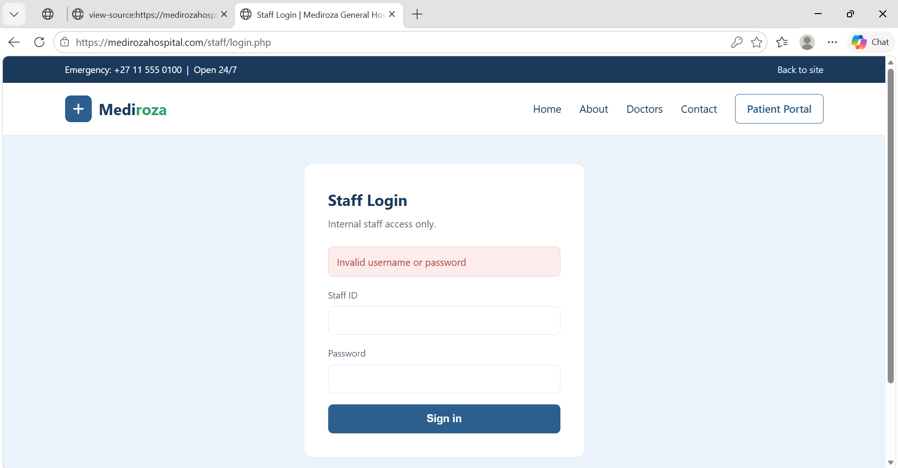

---

## 📁 Repository Contents

```
.
├── README.md                              ← this file
├── Mediroza_Pentest_Report.pdf            ← full professional report (24 pages)
├── screenshots/                            ← key evidence referenced above

```

The full report (`Mediroza_Pentest_Report.pdf`) contains the complete reconnaissance log, every piece of evidence, a formal risk rating matrix, and detailed remediation guidance for each finding.

---

## ⚠️ Risk Rating

| ID | Finding | Likelihood | Impact | Overall Risk |
|----|---------|-----------|--------|---------------|
| F1 | SQL Injection — Auth Bypass | High | Critical | **Critical** |
| F2 | Exposed DB Backup | High | Critical | **Critical** |
| F3 | Weak PDF Passwords | Medium | High | **High** |
| F4 | Username Enumeration | High | Low | **Medium** |
| F5 | Metadata Disclosure | Medium | Medium | **Medium** |
| F6 | Staff Login (resistant) | — | — | **Informational** |

---

## ✅ Key Recommendations

- Use parameterised queries / prepared statements across all authentication endpoints
- Remove `/old/` and all legacy backups from the public web root; store backups outside the web-accessible directory
- Disable directory listing on the web server
- Enforce strong, system-generated passwords for protected documents rather than user-chosen ones
- Standardise login error messages to prevent username enumeration
- Strip metadata from PDFs before external distribution
- Add CSRF protection, rate-limiting, and account lockout to all login forms

## 📃 Penetration Testing Report

Full details for each item are in the final report.
[Download the Report](Mediroza_Pentest_Report.pdf)

---
# 👤 Author

**Muhammad Talha** <br>

🔗 LinkedIn: [linkedin.com/in/talha2715](https://www.linkedin.com/in/talha2715/) <br>

**Date:** October 02,2026

**Classification:** Confidential — prepared for Networkwalks internship review only
